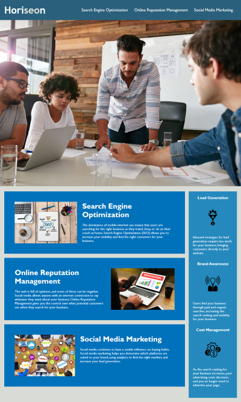

# Challenge - Code Refactor

## Description 

The client Horiseon, a marketing agency, needed their website optimised for search engines. 

This codebase includes the refactored HTML code to use semantic markup, ensuring accessabiltiy best practices are followed. 

HTML & CSS was optimised as well as some bugs and typos were also addressed. 

## Installation

Simply clone or download this project as a zip file & extract to your websites root directory.

## Technologies
 

## To Do
Optimise the site images - a majority have a very large payload.